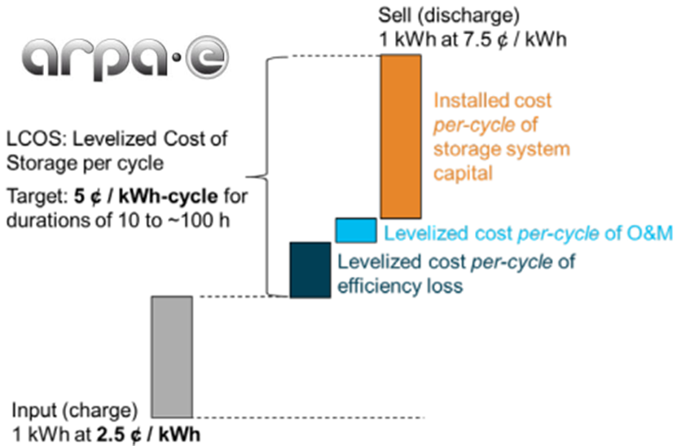
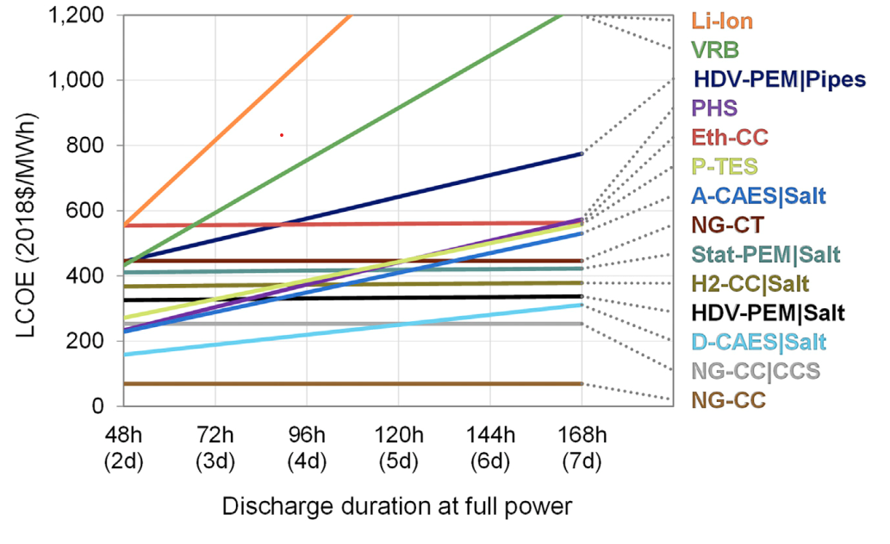
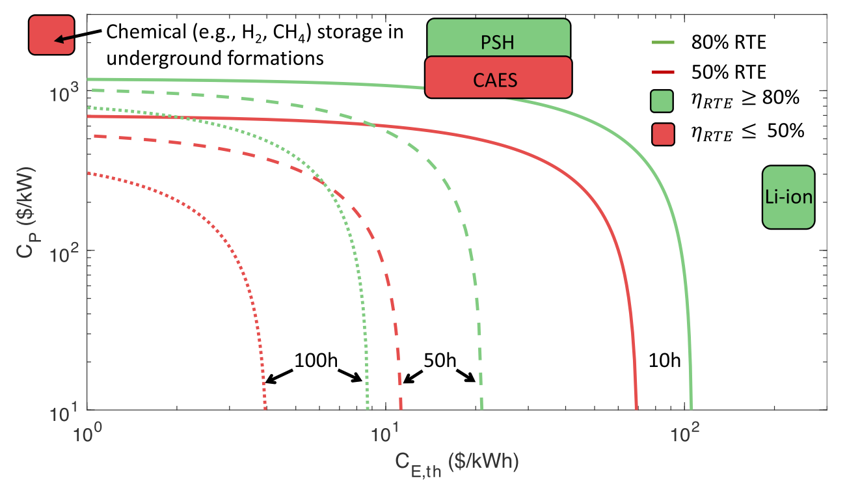

This page is an ongoing attempt to consolidate data from the literature on the material cost floor for the energy capital cost ($\\$/kWh$) for different energy types suitable for long duration storage. 

# Levelized cost of storage (LCOS)

A key metric for energy storage systems is levelized cost of storage (**LCOS**) which can be defined as the extra cost, in addition to the **Price of Electricty** paid by the system operator, that must be charged to make the energy storage system economically viable. 

<figure style="display: inline-block">

<figcaption style="text-align: center;font-style: italic;">A schematic of the levelized cost of storage from the <a href="https://www.semanticscholar.org/paper/Duration-Addition-to-electricitY-Storage-(DAYS)/e9951a5c294cf96dd9840cc6d2d44a66b61e1d32">Source: Duration Addition to electricitY Storage (DAYS) Overview</a></figcaption>
</figure>

With some simplifying assumptions (no discount rate, no O&M, no end of life, capacity factor = 1) we can form a simplified version of the LCOS:

$$
LCOS[$/kWh] = (\frac{1}{\eta_{RT}} -1) * PE + \frac{1}{LT*\eta_{out}}(C_{kW} + C_{kWh} * DD)
$$

<button type="button" class="collapsible">Open for term definitions and  derivation of LCOS equation </button>
  

    

  

## LCOS Duration dependence

Below is an interactive plot to explore how LCOS depends on duration. Note: you have to move the sliders to initialize the visualization. 



This plot is inspired by recent work from [Hunter et al.](https://doi.org/10.1016/j.joule.2021.06.018).

<figure style="display: inline-block">

<figcaption style="text-align: center;font-style: italic;">Recent modeling by <a href="https://doi.org/10.1016/j.joule.2021.06.018">Hunter et al.</a> Showing the Levilzed cost of electricity (LCOS + PE) for different technologies</figcaption>
</figure>

## Regions of viability

Let's assume that we want to have a LCOS of no more than 0.1\\$/kWh with the price of electricity being 0.05\\$/kWh. Let's also make the simplifying approximation that $\eta_{RT} \approx \eta_{out}$ We can then solve the LCOS equation for the maximum allowable $C_{kW}$ as a funciton of $C_kWh$, defining a tradeoff curve of economic viabaility.  

$$
C_{kW} = LT*\eta_{RT}[LCOS - (\frac{1}{\eta_{RT}} - 1)*PE] - C_{kWh}*DD
$$

Below is an interactive plot to explore this line of economic viability. Regions to the left and below of the line are viable. Note: you have to move the sliders to initialize the visualization. 



This plot was inspired by recent modeling work by [Albertus](https://doi.org/10.1016/j.joule.2019.11.009). 

<figure style="display: inline-block">

<figcaption style="text-align: center;font-style: italic;">Recent modeling by <a href="https://doi.org/10.1016/j.joule.2019.11.009">Albertus</a> that indicates regions (left of lines) of economic viability for different combinations of storage medium fiugres of merit </figcaption>
</figure>

# LCOS for Long Duration Storage 

For long durations the last term will begin to dominate the expression and the LCOS can be approximated 

$$
LCOS \approx \frac{C_{kWh}}{Lifetime*\eta_{out}} * Duration
$$

The scaling factor with duration represents the key figure of merit for long duration energy storage systems. In this expression the component that will be able to vary over many orders of magnitude is $C_{kWh}$ and therefore could be considered the most important. We can get a handle on the ballpark of what $C_{kWh}$ is required by considering a long-duraiton energy storage system with the following characteristics

* LCOS of of 10¢/kWh
* Duration of 100 hours
* Lifetime of 10 years (~$10^6$ hours) and  
* $ \eta_{out} = 1$

We calculate $ C_{kWh} <\approx \\$10/kWh $ meaning a energy storage medium cannot have a capital cost significantly above this to be viable for durations on the order of 100 hours. 

# Materials Cost Floor

The cost of the material that the storage medium is built out of sets a lower bound on the achievable $C_{kWh}$. Therefore we meed to find a material that costs of less than $ 10\\$/kWh$. Below is a plot that shows data on the energy capital cost of energy stored in different materials for different forms of energy. Viral refers to forms of energy limited by materials strength of a container (flywheel, pressure vessel, SMES). Mouse over to see the name of the material. This plot is an ongoing work in progress with more data to be added. 

  <embed type="text/html" src="mat_cost/mat_cost_compare.html" style="width:100%" height=800> 

Sources: 

[Alva et al. 2018](https://doi.org/10.1016/j.energy.2017.12.037)

[Li et al. 2017](https://doi.org/10.1016/j.joule.2017.08.007)

[Kale 2018](https://doi.org/10.1016/j.egyr.2018.09.003)



